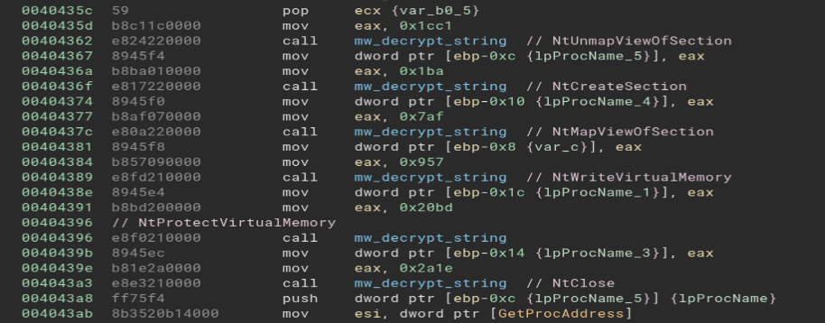
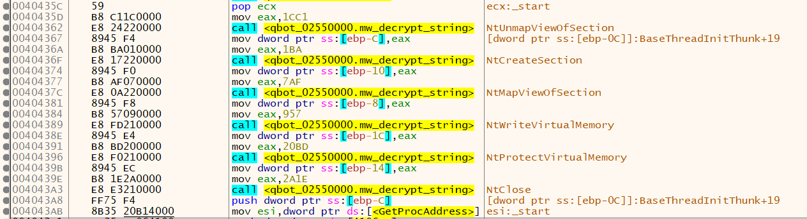

# BinjaExportTox64dbg (v1.0.0)
Author: **moval0x1**

_Export notations from Binja to x64dbg_

## Description:

Export notations from Binja to x64dbg.

Binja disassembly with renamed/added functions and comments

x64dbg disassembly with imported functions and comments

## Installation Instructions

Clone this repo into your Binary Ninja plugin directory.

## Minimum Version

This plugin requires the following minimum version of Binary Ninja:

* 4526

## License

This plugin is released under an [MIT license](./LICENSE).

## Metadata Version

2

## Credits

Inspired by [ghidra_ExportToX64dbg](https://github.com/schlafwandler/ghidra_ExportToX64dbg)